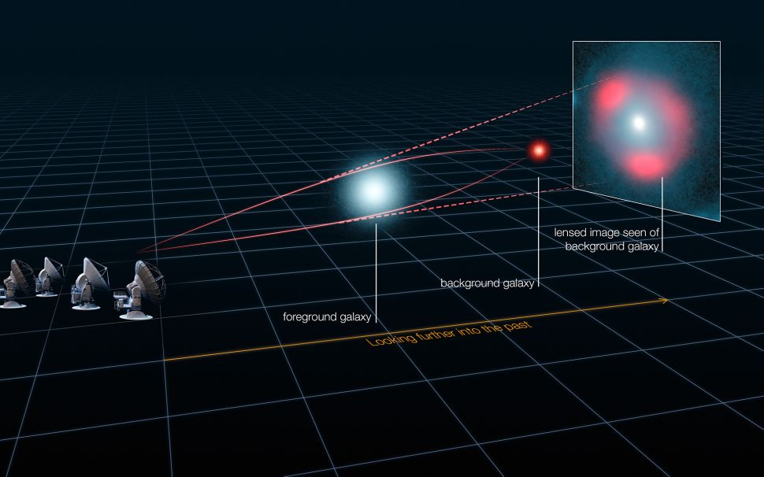
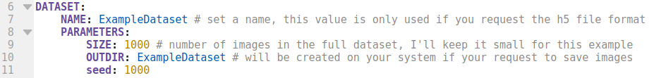
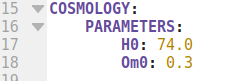
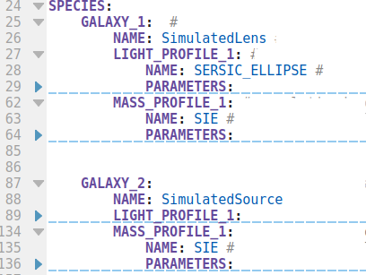
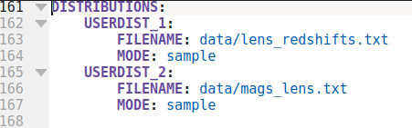
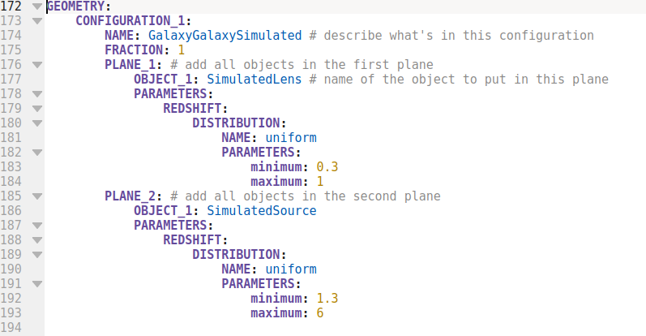

---
bibliography: references.bib
nocite: '@*'
... 
# Project 01 - Strong Lensing Simulations with Lenstronomy

## INTRODUCTION

Strong lenses is a phenomenon that occurs when the light of a distant galaxy suffers a distortion when passing by a massive object (such as another galaxy or a galaxy cluster). These systems are exceptionally interesting because of the magnification effect, which allows us to observe objects that are even farther in the universe. Nevertheless, the study of such objects can be extremely expensive, due to the amount of time required in the large telescopes for the observation of it. Alternatively, the study of a synthetic population is extensively cheaper and it can  assist us in the understanding of observed systems. 

In this work I intend to create a simulated sample of strong lenses using the deeplenstronomy library in python. Additionally, in order to assure that these computationally created systems can exist in the real universe, I shall compare it to an observed sample of strong lensing. 

## Can we create a simulated sample that look real?

- Strong Lens systems are “rare”

- Observation are expensive

- Real samples take time

## Strong Lensing?

Image from ALMA (ESO/NRAO/NAOJ). But there also a really cool video from [HubbleESA](https://www.youtube.com/watch?v=Rsx0AGQhQvs)

## The DES survey simulated sample

This data set has 23 columns that caracterise 18598 strong lens systems. The deeplenstronomy would allow me to reproduce most of then, but I can't do it because it means a lot of iterations which leads to a huge computational cost. So I will keep it simple and focuse in a simple lens' observables: the magnitudes at the g, r and i band. Besides I shall relate it to the lens redshift.

## The Deeplentronomy

The deeplenstronomy is a module created in python for the simulation of strong lens datasets. One can find more informations [here](https://pypi.org/project/deeplenstronomy/) and [here](https://github.com/deepskies/deeplenstronomy).

In addition to that this project was based in the Deeplentronomy full example that can be found [here](https://deepskies.github.io/deeplenstronomy/Notebooks/FullExample.html)

### Before the code

we have to set the system configuration. I have faced some problens due the version of some puython libraries. So mabe it will be coutious to create a python enviroment with the follow specifications

> wheel = 0.22
>
> scipy = 1.5.2
>
> pandas = 1.1.2
> 
> numpy = 1.19.1
>
> matplotlib = 3.3.2
>
> astropy = 4.0.1.post1
>
> h5py = 2.10.0
>
> pyyaml = 5.3.1
>
> mpmath = 1.1.0
>
> future = 0.18.2
>
>lenstronomy = 1.6.0

and install the deeplens version 0.0.2.0 with the command

> `pip install git+https://github.com/deepskies/deeplenstronomy.git@v0.0.2.0`

### The configuration File

Most of the deeplenstronomy magic ocours at the configuration file (configuration_file.yaml). It will be defined in 5 section: "DATASET", "COSMOLOGY", "SPECIES", "DISTRIBUTIONS" and "GEOMETRY".

The **DATASET** section looks like this:

and it shall contain the basic information of the dataset, as for example the directory where it will be saved and the size of the DS, in this example I will generate 1000 SL systems

The **COSMOLOGY** section looks like this:

here we are going to use the standart cosmological model, but we need to define it here.

The **SPECIES** section is where we define the objects in our data set. It can have as many objects as you wish. But because the data set that I will create will be a galaxy-galaxy lens system, we will only need a galaxy to be our lens and a galaxy to be the source. It show be like this:

The **DISTRIBUTIONS** section is where we indicate the path for files with the distributions that we may wnat to use in our data set, I will talk more abot how to gerate these files later 

Finally the **GEOMETRY** section 

here we divide the final images in planes, the separation of the planes will be given by the redshift. You can define as many geometry as you want, with as many planes as you wish, but here I may keep it simple and define one geometry witha plane for the lens and one plane for the source.

## Links
You can access the presentation [here](https://docs.google.com/presentation/d/e/2PACX-1vR2NZ0LvKVMzO5zaNE6dVN1I6R8urJjNUO6ZcVzPK53Ub6o0-_ZdrPRMPUog8pUgDS2ahr-qhLfXPBT/pub?start=false&loop=false&delayms=3000)

## Bibliografy
``@article{deeplenstronomy,
  doi = {10.21105/joss.02854},
  url = {https://doi.org/10.21105/joss.02854},
  year = {2021},
  publisher = {The Open Journal},
  volume = {6},
  number = {58},
  pages = {2854},
  author = {Robert Morgan and Brian Nord and Simon Birrer and Joshua Yao-Yu Lin and Jason Poh},
  title = {deeplenstronomy: A dataset simulation package for strong gravitational lensing},
  journal = {Journal of Open Source Software}
}

@article{lenstronomy,
    title     =   "lenstronomy: Multi-purpose gravitational lens modelling software package",
    journal   =   "Physics of the Dark Universe",
    volume    =   "22",
    pages     =   "189 - 201",
    year      =   "2018",
    issn      =   "2212-6864",
    doi       =   "10.1016/j.dark.2018.11.002",
    url       =   "http://www.sciencedirect.com/science/article/pii/S2212686418301869",
    author    =   "Simon Birrer and Adam Amara",
    keywords  =   "Gravitational lensing, Software, Image simulations"
}``

